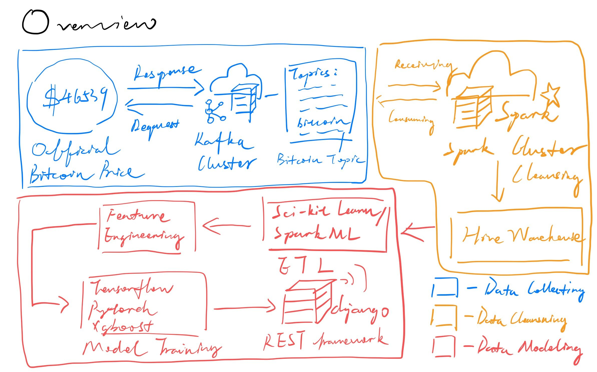

# Time Series Forecasting for Bitcoin Price

> ***Architectural Decisions Document***

## 0. Overview

General ML Pipeline - 

## 1. Data Source

### Technology Choice

For concept realization, I only use a CSV file as my data source. When we consider production environment, I tend to choose Kafka to gather Bitcoin price data in real-time and integrate Kafka message queue with Spark Streaming.

### Justification

Kafka is distributed and fast, Spark Streaming can easily connect with it effectively. Spark also has the ability to handle the following ETL process and build up Machine Learning pipelines.

## Streaming analytics

### Technology Choice

In this part, Spark Streaming apps consume different Kafka message topics here which shall perform data cleansing here.

### Justification

Data cleansing it's an important process in a data machine learning pipeline and Spark Streaming has powerful type-level checking and abnormally processing.

## Data Integration 

### Technology Choice

After streaming cleansing, Spark shall gather different categories of data into different groups. Spark SQL is used in this part.

### Justification

Spark SQL is handy on `groupBy` kinds of tasks.

## Data Repository

### Technology Choice

I tend to choose Hive as our enterprise data storage.

### Justification

Hive it's based on HDFS and distributed-native. Spark is naturally compatible with Hive as well.

## Discovery and Exploration 

### Technology Choice

In this part, I use `Scikit-Learn` to analyze bitcoin price series' trend, seasonality, cyclic and error pattern.

### Justification

`Scikit-learn` is powerful and easy to use. In production, it can also be done with `SparkML`

## Actionable Insights

### Technology Choice

After analyzing time series' linear and non-linear features, we use them to train our hybrid model to perform prediction.

### Justification

Hybrid model, which I choose linear regression and gradient boost decision tree regressor here, can learn those two kinds of features better than singleton model.

## Applications / Data Products

### Technology Choice

Company can use this forecasting model to help their trading strategy model to make transaction decisions more wisely.

### Justification

Strategy model are more powerful when they have an accurate forecasting data.

## Security, Information Governance and Systems Management

### Technology Choice

All data and model are stored and deployed on company's private cloud server using Hadoop, Spark cluster and Django REST API framework.

### Justification

All of this frameworks support authentication and encrypted sessions.